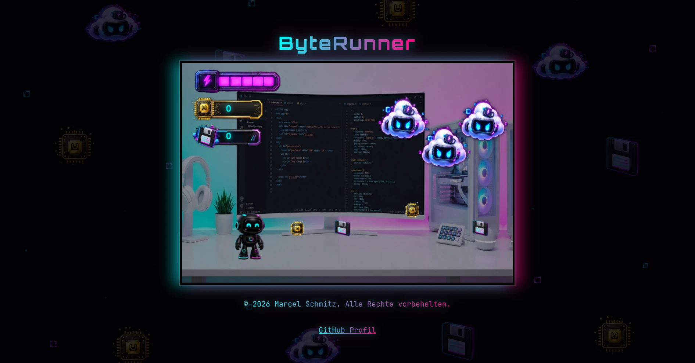

# 🚀 ByteRunner

> Ein actiongeladenes Cyberpunk-Jump-’n’-Run-Spiel, entwickelt mit JavaScript, objektorientierter Programmierung und HTML5 Canvas.



---

## 📖 Über das Projekt

**ByteRunner** ist ein browserbasiertes 2D-Jump-’n’-Run-Spiel im futuristischen Cyberpunk-Setting. Die Hauptfigur navigiert durch eine gefährliche Welt, weicht Gegnern aus, sammelt Items und stellt sich am Ende einem epischen Endboss.

Das Projekt wurde von Grund auf nach strengen **Clean-Code-Prinzipien**, modularer Klassenstruktur und mit vollständiger **JSDoc-Dokumentation** entwickelt.

---

## ✨ Features

- **Objektorientierte Architektur:** Saubere Trennung von Spiellogik, Entitäten (Character, Endboss, MouseDrone) und UI-Elementen.
- **Dynamische Physik & Kollisionserkennung:** Eigens implementierte Schwerkraft-, Sprung- und Kollisionsmechaniken.
- **Audio-System:** Dynamische Steuerung von Hintergrundmusik, Lauf- und Boss-Sounds via `AudioHub`.
- **Clean Code Standards:** Jede Methode ist kompakt (< 14 Zeilen), sprechend benannt und vollständig mit JSDoc dokumentiert.

---

## 🎮 Steuerung

| Taste                | Aktion                |
| :------------------- | :-------------------- |
| **A / Pfeil links**  | Nach links bewegen    |
| **D / Pfeil rechts** | Nach rechts bewegen   |
| **W / Pfeil oben**   | Springen              |
| **L**                | Disc werfen (Angriff) |

---

## 🛠️ Verwendete Technologien

- **JavaScript (ES6 Modules):** Modulare und moderne Skriptstruktur.
- **HTML5 Canvas:** Performance-optimiertes Rendering der Spielwelt.
- **CSS3 / Cyberpunk UI:** Stylisches, neonfarbenes Retro-Futurismus-Design.
- **Git & GitHub:** Versionskontrolle und Best Practices (Clean Commits, `.gitignore`).

---

## 📦 Installation & Lokaler Start

Da das Projekt ohne schwere Build-Tools auskommt, kannst du es ganz einfach lokal im Browser starten:

1. Repository klonen:
    ```bash
    git clone https://github.com/marcel-schmitz-dev/ByteRunner.git``
    ```
